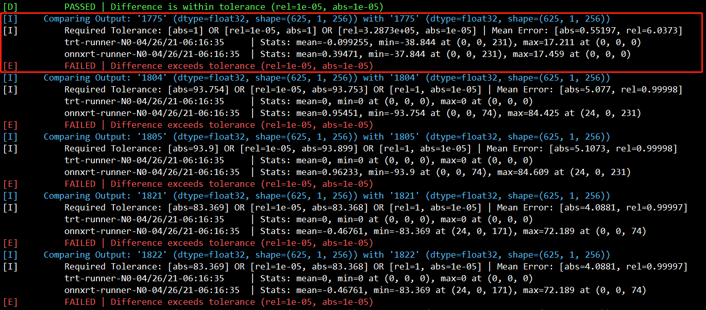

## TensorRT for DETR

**美迪康AI Lab**


#### 0. 环境配置

+ TensorRT Docker镜像环境：`nvcr.io/nvidia/tensorrt:21.03-py3`(TensorRT-7.2.2.3),需要Host中安装好Docker和Nvidia-Docker2和版本为`Driver Version: 460.32.03`的显卡驱动.
+ 在Docker镜像内需要安装相应的Python库，可以在项目下执行`pip3 install -r requirements.txt -i  http://mirrors.aliyun.com/pypi/simple/ --trusted-host mirrors.aliyun.com`进行安装.
+ 显卡类型：Tesla T4 (16G显存).
+ CUDA 11.2， cuDNN-8.1.
+ 系统信息为：`Linux version 4.15.0-139-generic (buildd@lgw01-amd64-035) (gcc version 7.5.0 (Ubuntu 7.5.0-3ubuntu1~18.04)) #143-Ubuntu SMP Tue Mar 16 01:30:17 UTC 2021`.

**项目结构及说明**

```shell
.
├── model  # DETR模型相关的python代码(主要来源[1].https://github.com/facebookresearch/detr)
│   ├── README.md
│   ├── __init__.py
│   ├── backbone.py  # backbone resnet50
│   ├── box_ops.py  
│   ├── detr.py     # DETR model build
│   ├── hubconf.py
│   ├── matcher.py
│   ├── misc.py
│   ├── position_encoding.py  # position_encoding，支持sine和自学习，默认是sine
│   ├── segmentation.py      # 分割的模型的build
│   └── transformer.py   # transformer的encoder和decoder包括多头的自注意力，Skip, FFN
|
├── trt_util  # TensorRT相关的辅助方法
│    ├── __init__.py
│    ├── calibrator.py   # INT8量化的calibrator
│    ├── common.py #host与device数据交互,TensorRT序列化engine及调用(支持FP32,FP16，INT8),Dynamic shape序列化engine及调用(支持FP32,FP16，INT8)
│    ├── plot_box.py # 画出detr推断预测的box
│    ├── process_img.py # detr图像预处理，支持numpy,torchvision, cupy
│    └── trt_lite.py  # tensorrt性能测试辅助方法，基于https://github.com/NVIDIA/trt-samples-for-hackathon-cn/blob/master/python/修改
|
├── calib_train_image   # INT8量化的数据约30660张, 开源代码该部分内容被删除
│   ├── A_57b26b46_2e1e_11eb_9d64_00d861c69d42.jpg
│   ├── ... ...
│   └── N9_50667548_2e21_11eb_ac9b_00d861c69d42.jpg
|
├── test   # 性能测试需要的测试图像约1000张，开源代码该部分内容被删除
│   ├── test_c6d6ecec_2fd1_11eb_b773_00d861c69d42.jpg
│   ├── ... ...
│   └── test_d4c4ea34_2fd1_11eb_9f0e_00d861c69d42.jpg
|
├── checkpoint  # DETR Pytorch 模型，开源代码该部分仅提供模型下载链接
│   ├── detr_resnet50.pth
│   └── log.txt
├── pic  # README 静态资源文件
|
├── detr_pth2onnx.py  # pytorch 转onnx支持static,dynamic shape, btached, onnx check, onnx-simplifier, onnx-graphsurgeon
├── generate_batch_plan.py  # 生成batched static tensorrt 序列化engine文件，支持FP32,FP16,任意batch size
├── inference_detr_onnx.py   # onnx runtime模型推断，支持static,dynamic shape,用于验证onnx的正确性
├── inference_detr_trt.py   # tensorrt模型推断，支持，static,dynamic shape,FP32,FP16,INT8并检验engine是否存在，不存在调用序列化程序
├── performance_accuracy_detr.py  # TensorRT识别精度的计算和可视化
├── performance_time_detr.py      # TensorRT benchmark的计算和可视化
├── trt_int8_quant.py  # INT8量化，并生成量化模型的engine和cache文件
|
├── requirements.txt   # Python package list
├── LICENSE     
└── README.md

# 说明：
# 1. README提供过程中用到的Linux 相关命令，比如 trtexec, polygraphy, Nsight Systems的使用
# 2. 用到的模型文件包括.pth,.onnx,.plan文件在README中提供百度云盘的下载地址
# 3. 项目过程中产生的log文件比如，测试benchmark生成的数据，序列化engine过程中的日志，polygraphy日志，Nsight Systems生成UI文件均在README中提供百度云盘下载地址

```


### 1.Pytorch checkpoint to ONNX 

```shell
# pytorch to onnx
$ python3 detr_pth2onnx.py -h

# batch_size=1, static
# 在项目下生成detr.onnx和detr_sim.onnx(simplify后的onnx)
$ python3 detr_pth2onnx.py --model_dir ./checkpoint/detr_resnet50.pth  --check --onnx_dir ./detr.onnx

# dynamic shape
# 在项目下生成detr_dynamic.onnx和detr_dynamic_sim.onnx
$ python3 detr_pth2onnx.py --model_dir ./checkpoint/detr_resnet50.pth  --check --onnx_dir ./detr_dynamic.onnx --dynamic_axes

# batch_size=n, static
# 生成./output/detr_batch_{n}.onnx和output/detr_batch_{n}_sim.onnx
$ python3 detr_pth2onnx.py --model_dir ./checkpoint/detr_resnet50.pth  --check --onnx_dir ./output/detr_batch_2.onnx --batch_size=2

```


**simplify的其他方式**

```shell
# onnx-simplifier
# static
$ python3 -m onnxsim detr.onnx detr_sim.onnx
# dynamic
$ python3 -m onnxsim detr_dynamic.onnx detr_dynamic_sim.onnx --input-shape "inputs:1,3,800,800"  --dynamic-input-shape
```

onnxruntime测试onnx模型

```shell
$ python3 inference_detr_onnx.py
```


**注意**：上述过程生成的detr_sim.onnx文件序列化engine后，TensorRT推断结果全部为0！

```python
# 需要onnx-graphsurgeon做如下修改 (该代码导师提供）
import onnx
import onnx_graphsurgeon as gs

graph = gs.import_onnx(onnx.load("./detr_sim.onnx"))
for node in graph.nodes:
    if node.name == "Gather_2648":
        print(node.inputs[1])
        node.inputs[1].values = np.int64(5)
        print(node.inputs[1])
    elif node.name == "Gather_2684":
        print(node.inputs[1])
        node.inputs[1].values = np.int64(5)
        print(node.inputs[1])
        
onnx.save(gs.export_onnx(graph),'changed.onnx')

```


### 2.TensorRT  Inference in FP32 or FP16 Mode

生成TensorRT序列化engine文件并调用，有两种方式:

+ 1.使用python实现

```shell
# 提供build engine和反序列化engine进行推断
# inference_detr_trt.py支持FP32,FP16的build engine和engine的推断，同时支持static shape和Dynamic shape的推断，前处理，后处理和结果可视化，支持INT8量化后engine的推断，包括static shape, dynamic shape及前处理后处理和结果可视化

# static shape
# FP32
$ python3 inference_detr_trt.py -h
$ python3 inference_detr_trt.py --model_dir ./detr_sim.onnx --engine_dir ./detr.plan --image_dir ./test

# FP16
$ python3 inference_detr_trt.py --model_dir ./detr_sim.onnx --engine_dir ./detr_fp16.plan --image_dir ./test --fp16

# INT8
$ python3 inference_detr_trt.py --model_dir ./detr_sim.onnx --engine_dir ./detr_int8.plan --image_dir ./test --int8

# dynamic shape 
$ python3 inference_detr_trt.py --model_dir ./detr_sim.onnx --engine_dir ./detr.plan --image_dir ./test --dynamic --batch_size=8

# 生成batch的engine
$ python3 generate_batch_plan.py --model_dir ./output/detr_batch_{n}_sim.onnx --engine_dir ./output/detr_batch_{n}_fp16.plan --batch_size={n} --fp16
# eg
$ python3 generate_batch_plan.py --model_dir ./output/detr_batch_2_sim.onnx --engine_dir ./output/detr_batch_2.plan --batch_size=2
$ python3 generate_batch_plan.py --model_dir ./output/detr_batch_2_sim.onnx --engine_dir ./output/detr_batch_2_fp16.plan --batch_size=2 --fp16
```

TensorRT Inference的结果Demo(上trt fp32,下trt fp16):

<center class="half">     </center>

+ 2.使用trtexec

  

```shell
# static shape
trtexec --verbose --onnx=detr.onnx --saveEngine=detr.plan   # error
trtexec --verbose --onnx=detr_sim.onnx --saveEngine=detr.plan

trtexec --verbose --onnx=detr_sim.onnx --saveEngine=detr.plan --fp16

# dynamic shape (error)
# FP32
trtexec --verbose --onnx=detr_dynamic_sim.onnx --saveEngine=detr_dynamic.plan --optShapes=input:1x3x800x800 --minShapes=input:1x3x800x800 --maxShapes=input:16x3x800x800  --workspace=10240   

# FP16
trtexec --verbose --onnx=detr_dynamic_sim.onnx --saveEngine=detr_dynamic_fp16.plan --optShapes=input:1x3x800x800 --minShapes=input:1x3x800x800 --maxShapes=input:64x3x800x800 --fp16   

```


> 该过程遇到的问题：
>
> 1. 在tag为20.12-py 的TensorRT镜像中，onnx转trt engine文件时出现了**Myelin Error** (fig1,fig2)[**该问题由导师协助解决，将TensorRT的Docker镜像的tag换成21.03-py**]
> 2. 如果不做onnx的simplify,无法序列化engine,报错如fig3 [**解决办法是进行onnx-simplifier**]
> 3. Dynamic Shape可以正常通过torch.onnx.export获得并且在onnxruntime下可正常调用，但是在序列化engine时，无法正常工作（我们提供了dynamic shape的序列化方法和序列化后engine的调用方法，但是遗憾无法序列化dynamic时的engine),序列化engine的错误信息如fig4.[**该问题现在依然没有解决，未来的工作希望基于TensorRT API重新搭建网络或Plugin添加不支持的层**]  **BUG???**
>


**fig1:Myelin Error**


**fig2: Myeline Error 对应ONNX结点**


**fig3:onnx不做simplify无法序列化**


**fig4:detr_dynamic_sim.onnx无法序列化engine，进而dynamic shape代码部分完成后无法进行dynamic shape的测试**


### 3.TensorRT Inference Time(IT) and Mean Value of Relative Error(MVRE)

```shell
# Inference Time(IT)
$ python3 performance_time_detr.py

# Mean value of relative error (MVRE)
$ python3 performance_accuracy_detr.py

# Nsight Systems
$ nsys profile -o nsight_detr_out python3 performance_time_detr.py
$ nsys-ui nsight_detr_out
```

+ benchmark的计算中关于Latency和Throughput的计算，设及的nRound为1000次，该统计保证预处理和后处理相同的条件下仅包含模型加速推断部分的统计
+ benchmark的计算中关于平均相对误差的计算采用预测Score和预测Box分开分别计算，使用1000张测试图片进行测试


<center><b>性能对比</b></center>


<center><b>Latency vs Throughput</b></center>


<center><b> 测试1000张图像，平均相对精度基本满足条件，正常的FP32在1e-6,FP16在1e-3数量级</b></cemter>


>该过程遇到的问题：
>
>4.关于平均相对精度的统计中发现，TensorRT序列化的engine在推断后的结果全部为0（使用`polygraphy run detr_sim.onnx --trt --onnxrt --onnx-outputs mark all --trt-outputs mark all`查看原因，得到错误信息如fig5，fig6在第1775个节点后就出现了错误；我们是正常把detr_sim.onnx序列换成功了，但是序列化的engine的识别结果不正确)[**可能是TensorRT ONNX parser权重解析的一个BUG**,这个问题已经在导师的帮助下解决，解决方式参考[第一节](### 1.Pytorch checkpoint to ONNX ),基于onnx-graphsurgeon修改了结点的信息]   **BUG???**




**fig5: 通过polygraphy 查看信息**


**fig6: 定位到polygraphy 找到的错误结点**


### 4.INT8 量化

1. INT8量化序列化INT8 Engine文件

```shell
# generate int8 model
$ python3 trt_int8_quant.py -h

$ python3 trt_int8_quant.py --onnx_model_path ./detr_sim.onnx --engine_model_path ./detr_int8.plan --calib_img_dir ./calib_train_image --calibration_table ./detr_calibration.cache --int8

```

使用约30660张训练图像进行INT8量化.


> 该过程遇到的问题：
>
> 5.失败了，cache文件没有出来！ 检查代码并没有发现什么异常，序列化的engine出来了（感觉并没有INT8量化），并没有cache文件出来。[**可能TensorRT的BUG**, 原因（导师解释）：因为onnx模型中有`where op`，这个`where op`只支持myelin作为backend，且没有int8实现，所以就直接跳过int8 calibration了，导师提供的解决办法是写一个`plugin`来替代`where op`，即使这样也不一定就能够进行int8 calibration]        **BUG???**

​            

2. TesorRT Inference in INT8

```shell
$ python3 inference_detr_trt.py -h
$ python3 inference_detr_trt.py --model_dir ./detr_sim.onnx --engine_dir ./detr_int8.plan --int8
```

提供了INT8推理引擎的推断代码.


### 5.Profile每一层的耗时

```shell
$ trtexec --verbose --onnx=detr_change.onnx --saveEngine=detr_batch1.plan 
$ trtexec --loadEngine=detr_batch1.plan --batch=1
```

```shell
$ trtexec --loadEngine=detr_batch1.plan --batch=1 --dumpProfile |& tee profile.txt
```


```shell
# 每一层的耗时，因为层数比较多，这里仅列出耗时比较长一些层的例子和耗时比较少的一些曾的例子

# 耗时比较多的层的例子：
--------------------------------------------------------------------------
Layer                               Time (ms)      Avg. Time (ms)   Time %
---------------------------------------------------------------------------
Conv_107 + Relu_110                 53.99           0.6427          1.8
Conv_123 + Add_126 + Relu_127       41.26           0.4912          1.4
Conv_298                            21.66           0.2579          0.7

上述类型的层有很多个
---------------------------------------------------------------------------

# 耗时比较少的层的例子
--------------------------------------------------------------------------
Layer                               Time (ms)      Avg. Time (ms)   Time %
---------------------------------------------------------------------------
MatMul_487                          3.29           0.0392           0.1
Add_488                             1.51           0.0179           0.1
ReduceMean_546                      0.95           0.0113           0.0
Sub_547                             1.22           0.0145           0.0
Add_690 + Relu_691                  4.71           0.0560           0.2

上述类型的层有很多个
---------------------------------------------------------------------------

```


### 6.未来的工作


1. 在ONNX序列化engine的过程中，发现不做onnx-simplifer序列化engine是有错误的，错误可以参考fig3,这可能是因为其中的一些op tensorRT目前还不支持，未来打算基于DETR网络结构通过TensorRT API搭建网络，实现前向推理加速；

3. INT8量化无法生成cache文件（写一个plugin来替代where op, 看是否可以解决INT8量化的问题）；
4. Dynamic shape的ONNX文件进行onnx-simplifier后，依然无法序列化engine,其错误信息和fig4相同，原因是onnx-simplifier并没有对dynamic shape的onnx起到任何简化作用，dynamic shape的onnx模型文件的op和1中面临的问题相同，下一步的工作就是基于TensorRT API或Plugin重新调整网络。


### 7.连接地址

1. 项目模型下载地址包括.pth,.onnx,.plan模型文件： 链接：https://pan.baidu.com/s/1IsHHfFi5zphpbfGTmvPIag      提取码：detr 
2. 项目中生成的日志文件下载地址： 链接：https://pan.baidu.com/s/1rvG2ApC67Jt61t3ISZA3Dg     提取码：logs 
3. DETR参考官方REPO:  <https://github.com/facebookresearch/detr>
4. DETR Paper: <https://arxiv.org/abs/2005.12872v1>
5. 项目中参考的代码地址1：<https://github.com/NVIDIA/trt-samples-for-hackathon-cn/blob/master/python/>
6. 项目中参考的代码地址2：<https://github.com/NVIDIA/TensorRT>


